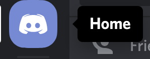
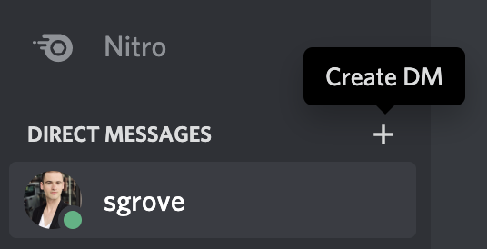
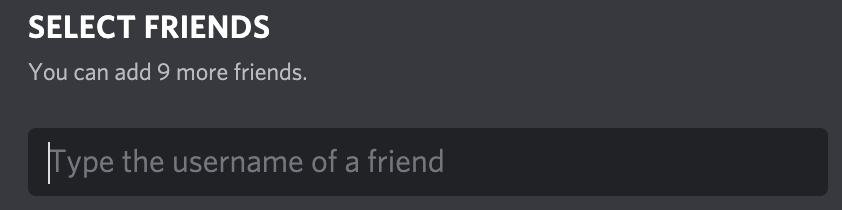
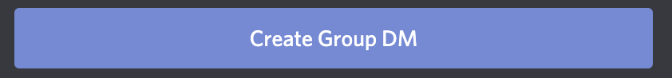

# Reason Dojo - May 2020

## Table of Contents
- [Reason Dojo - May 2020](#reason-dojo---may-2020)
  - [Table of Contents](#table-of-contents)
  - [Event Details](#event-details)
    - [Description](#description)
    - [Schedule](#schedule)
    - [Location (virtual)](#location-virtual)
  - [Resources](#resources)
    - [Prepping for the event](#prepping-for-the-event)
    - [Creating a Group DM on Discord](#creating-a-group-dm-on-discord)
  - [Projects Built during this Dojo](#projects-built-during-this-dojo)
  - [Contributing](#contributing)
  - [License](#license)
  - [Thanks!](#thanks)

## Event Details

Below, you'll find all the information about the event itself.

### Description

Reason Dojo is a unique take on meetups. In the beginning, we'll walk you through installing Reason and setting up your IDE. After that, we'll present you with an app & requirements. We'll split everyone up into groups. Each group will have at least one experienced Reason developer. 

Your goal: build the app as a group during the allotted hacking time.

The least experienced developer will drive (i.e. write code) while the others help guide. The purpose of this is both to:
1. take the pressure off the new person (they follow the guidance of others)
2. let the others mentor and guide as they help architect the app

If you've never been done a dojo-style meetup before, it's the perfect opportunity to:
- learn + improve your Reason skills 
- help others by working as a team (with both new + experienced Reason devs)
- build something fun that you can take home

### Schedule

Below is the schedule for the event. We expect it to run for ~3hrs:
| hour     | title           | description                                                                       |
|----------|-----------------|-----------------------------------------------------------------------------------|
| 00:00:00 | Introduction    | Joe will welcome Sean to explain Reason Dojo and explain how the event will work. |
| 00:30:00 | Hacking Session | Groups will meet on Discord and get started programming.                          |
| 02:30:00 | Demos           | Sean will call groups up and have them demo their apps on Zooom.                  |
| 02:50:00 | Closing         | Sean will lead discussion on Reason feedback discussion.                          |

### Location (virtual)

This particular event is happening online using a combination of Zoom and Discord. The main sessions (Introduction, Demos, and Closing) will take place on Zoom and be recorded. The Hacking Session will take place on Discord. We encourage you to use Group DMs to coordinate with your team members over voice or video chat.

We will also have places to socialize during the event on both Discord and Zoom.

## Resources

Below, you'll find helpful resources for both before, during and after the event:

### Prepping for the event

Don't worry if you've never written a line of Reason before! We'll cover installing Reason and setting up your IDE during the introduction of the event. Make sure you have [Zoom](https://zoom.us/download) and [Discord](https://discordapp.com/download) installed and bring a positive mental attitude to the event! 

### Creating a Group DM on Discord 

Group DMs on Discord will be used to communicate with you and your group during the Dojo. To create a Group DM, you'll need the following:
- A Discord account ([sign up to create one](https://discordapp.com/register))
- The Discord app ([download here](https://discordapp.com/download))
- Be friends with the people who will join your group (follow [this guide](https://support.discordapp.com/hc/en-us/articles/218344397-How-do-I-add-my-friend-to-my-friends-list-) to add someone)

Now that you have that, you can create a group. Follow these steps:
1. Inside the Discord app, navigate to the Home page (click the Discord icon in the left sidebar)

2. Under direct messages, click the "+" icon

3. Type the username of the friends that you want to add to your group

4. Click "Create Group DM" 

## Projects Built during this Dojo

After this event, we will invite groups to open PRs to add links to their projects here:

## Contributing

We welcome contributions! If you would like to submit your project, fix a typo, or make a suggestion, please open a pull request. 

## License

This repo, the code and the event materials are all licensed under the MIT License. Please see [LICENSE](./LICENSE) for more details.

## Thanks!

This event wouldn't be possible with out the lovely folks from the Reason community and support form the following companies:

<table>
  <tr valign="top">
    <td width="50%" align="center" colspan="2">
      <a href="https://opensource.facebook.com/">Facebook Open Source</a> 
      
    </td>
    <td width="50%" align="center" colspan="2">
      <a href="https://www.onegraph.com">OneGraph</a> 
      
    </td>
  </tr>
</table>